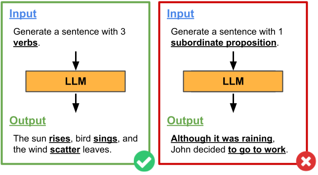

# Evaluating Large Language Models via Linguistic Profiling

    

This repository contains data associated to the paper Evaluating Large Language Models via Linguistic Profiling.

> **Abstract:** Large Language Models (LLMs) undergo extensive evaluation against various benchmarks collected in established leaderboards to assess their performance across multiple tasks. However, to the best of our knowledge, there is a lack of comprehensive studies evaluating these models' linguistic abilities independent of specific tasks. In this paper, we introduce a novel evaluation methodology designed to test LLMs' sentence generation abilities under specific linguistic constraints. Drawing on the `linguistic profiling' approach, we rigorously investigate the extent to which five LLMs of varying sizes, tested in both zero- and few-shot scenarios, effectively adhere to (morpho)syntactic constraints. Our findings shed light on the linguistic proficiency of LLMs, revealing both their capabilities and limitations in generating linguistically-constrained sentences.

## Data

The repository contains the set of sentences generated by the LLMs, along with the values of their (morpho)syntactic properites (extracted with [ProfilingUD](http://linguistic-profiling.italianlp.it/)). In particular, the repository is structured in two folders:

- **POS** - Contains the sentences generated when the models were contrained on POS.

- **syntax** - Contains the sentences generated when the models were contrained on syntax.

**POS** and **syntax** contains a folder for each of the 5 tested model. Each file within the models' folders (both for zero- and few-shot generations) contains one sentence per row and are structured as follows:

 - **Features** - The first 21 columns correspond to the linguistic properites extracted from the generated sentence.

 - **sentence** - The generated sentence.
 
 - **_P_-constraint** - The value of the property _P_ for which the model was constrained during generation.

